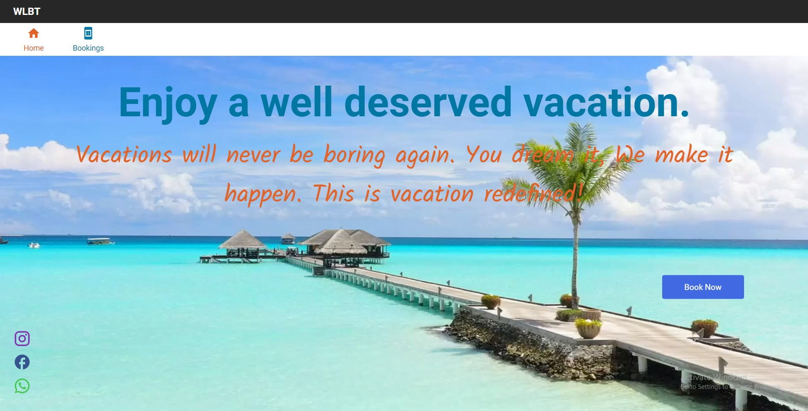
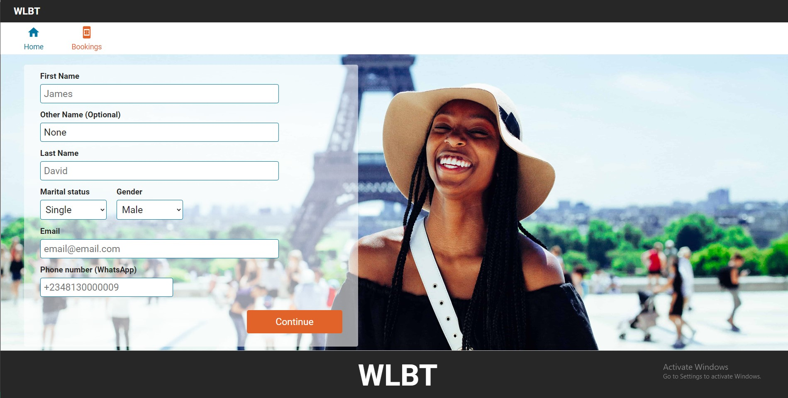
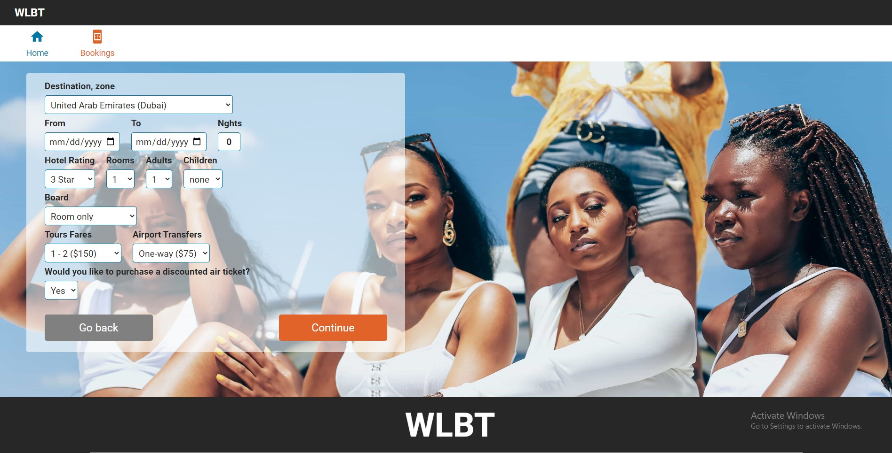
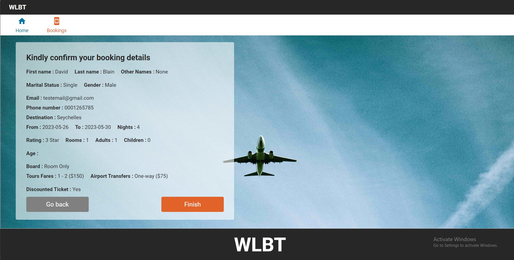

https://testbuildwlbt.netlify.app/

# WLBT Tour Reservation APP

WLBT tour Reservation app is designed to collect basic reservation information to different tourist destinations from vacationers and vacation plans can be prebooked ahead of high-season. This app lets users choose their destination, hotel facility, airport pickup and dropoff, passenger gender, duration of stay, passenger size.

## Overview

### The challenge

Users should be able to:

- Collect user personal information with a form
- Collect travellers destination of choice information
- See a summary of their selections on the final step
- Confirm their order
- View the optimal layout for the interface depending on their device's screen size
- Receive form validation messages if:
  - A field has been missed
  - The email address is not formatted correctly
  - A step is submitted, but no selection has been made
- Forward the information collect for processing

### Screenshot

- Solution URL: [https://testbuildwlbt.netlify.app/]
- Live Site URL: [https://testbuildwlbt.netlify.app/]

## My process

### Built with

- Semantic HTML5 markup
- CSS custom properties
- Flexbox
- CSS Grid
- Mobile-first workflow
- [React](https://reactjs.org/) - JS library
- [SMTPjs](https://smtpjs.com/) - Email library
- [Styled Components](https://styled-components.com/) - For styles

## Author

- Website - [Ugorji E. Victor](https://blcktitan.github.io/Eze-Portfolio/)
- Frontend Mentor - [@BlckTitan](https://www.frontendmentor.io/profile/BlckTitan)
- LinkedIn - [@yourusername](https://www.linkedin.com/in/eze-ugorji-33a9301a7/)